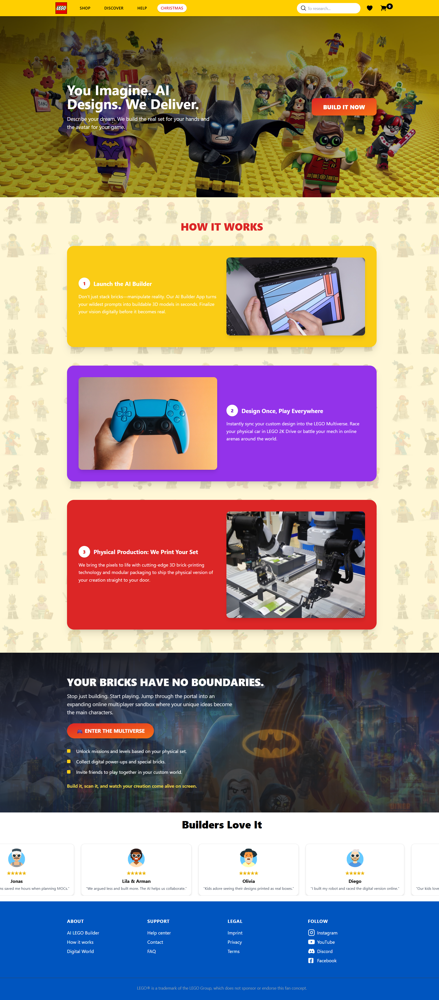
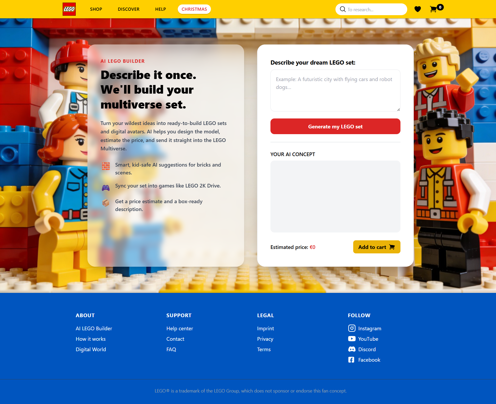

# LEGO-Inspired Ecommerce Frontend

A LEGO-inspired ecommerce frontend prototype built with Vue 3, Vue Router, Pinia, Vite, and TailwindCSS.

## Overview

This project is an unofficial LEGO-inspired ecommerce and custom set-builder frontend.

It was originally created as a university project for a friend. I helped rebuild and improve the project using Vue instead of a plain HTML and CSS structure.

The application includes a marketing homepage, product-style sections, a custom set-builder interface, cart functionality, reusable Vue components, routing, and interactive UI elements.

The “AI builder” is a simulated frontend feature. It does not connect to a real AI model or external AI service. It generates sample concept data locally using the user’s prompt and randomized values.

## Screenshots

  

  

## Status

Course-related collaborative frontend prototype from 2025.

The repository is preserved to showcase Vue development, component-based architecture, routing, state management, frontend interactions, and ecommerce UI design.

## My Role

- Helped rebuild the original project from plain HTML and CSS into Vue
- Worked on Vue component structure and page organization
- Helped implement the custom set-builder interface
- Implemented the simulated concept-generation feature
- Worked on cart state management using Pinia
- Added interactive UI behavior and frontend animations
- Helped improve the visual layout and responsive structure
- Contributed to the overall frontend implementation

## Tech Stack

- Vue 3
- JavaScript
- Vue Router
- Pinia
- Vite
- TailwindCSS
- ESLint
- Prettier

## Notes

- This is an unofficial fan-made project.
- It is not affiliated with, sponsored by, or endorsed by the LEGO Group.
- LEGO is a trademark of the LEGO Group.
- The AI-style builder is simulated and does not use a real AI service.